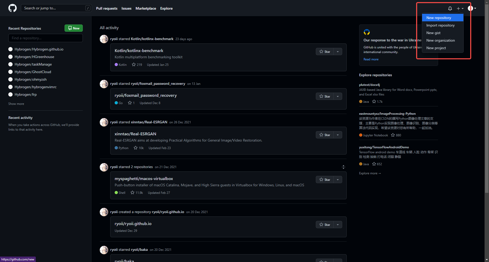
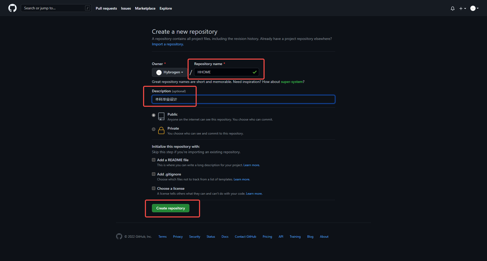
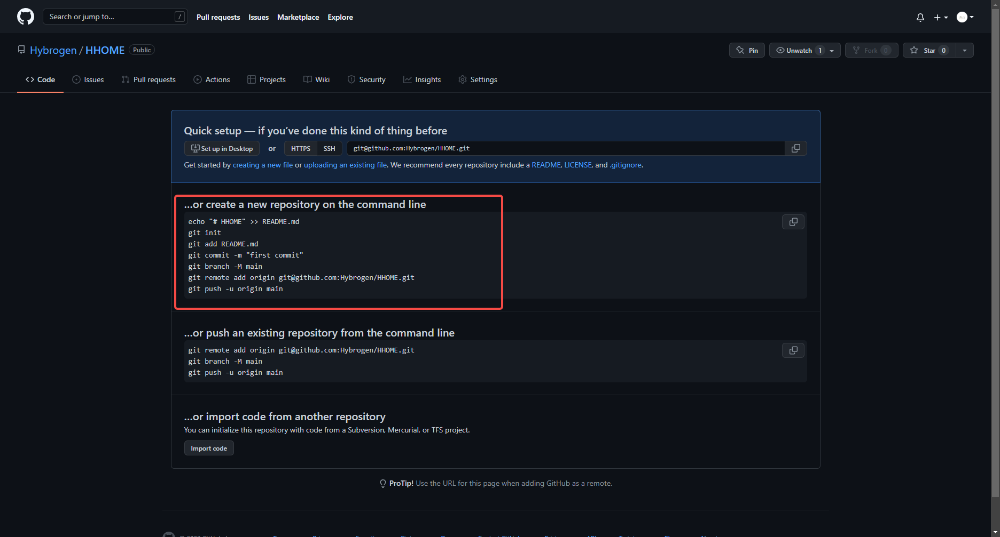

- [新建一个项目](#新建一个项目)
- [往新项目中添加本地项目](#往新项目中添加本地项目)
- [后续更新](#后续更新)

### 新建一个项目
1. 进入 [github.com](https://github.com/) 并登录【有时需要代理才能打开网页
2. 点击页面右上角头像左边的的加号 
3. 选择第一条 `New repository`
4. 输入你的项目名 -> 描述（可以不填）-> 点击 `Create repository` 

### 往新项目中添加本地项目
按照上面的步骤创建项目之后，因为是空仓库所以会显示提示
<br>

我们使用框红部分的命令即可
```bash
# 进入想要放到 Github 上的项目的根目录
cd HHOME/
# 按照步骤一步一步做
git init
git add ./*
git commit -m "first commit"
# 执行上面这一步时可能会报错，因为没有连接用户，根据提示操作即可
git config --global user.email "hon@zinchon.com"
git config --global user.name "Hybrogen"
git commit -m "first commit" # 重新提交
# 接下来我们继续走步骤
git branch -M main
git remote add origin git@github.com:Hybrogen/HHOME.git
git push -u origin main
```
上面进行 **最后一步** 时可能需要 **添加密钥** ，我已经做过太多次懒得演示了，先请自行 [百度](https://cn.bing.com/search?q=fatal%3A+Could+not+read+from+remote+repository.&cvid=59a643be3552440587b46b1f582854d5&aqs=edge..69i57j69i58.777j0j1&pglt=163&FORM=ANNTA1&PC=U531) 叭

我这边是直接把之前生成过的 `id_rsa` 放到了我的 `~/.ssh` 文件夹里改一下权限 `chmod 444 id_rsa` 就直接可以了 $_{PS: 刚放进去的时候，直接运行报错笑死我，说文件太开放哈哈哈哈}$ 

### 后续更新
当你更新了一些代码和文件之后，比如更新一个 `README.md`
```bash
git add README.md
git commit -m "更新 README"
git push -u origin main
```
走一遍这三行命令即可
